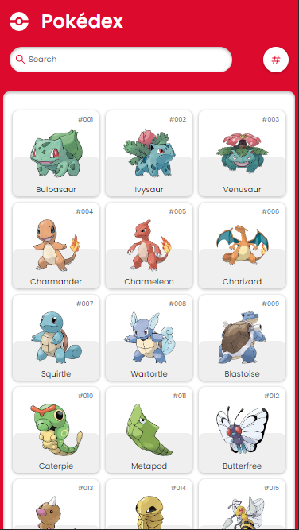
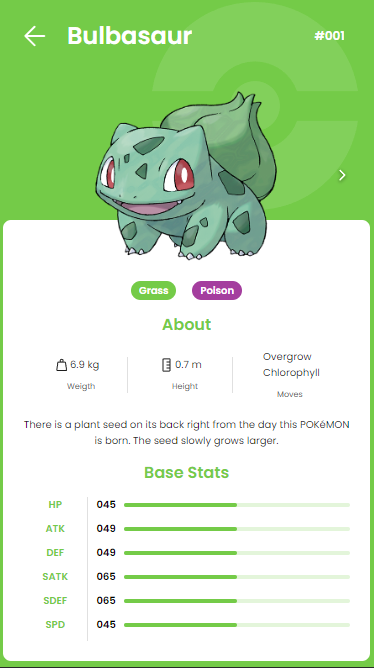
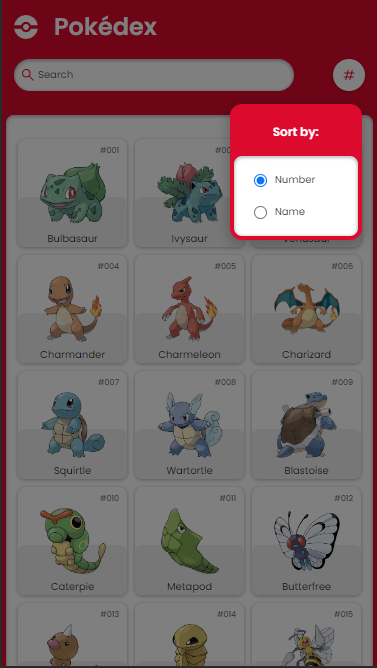

# Pokédex

## Description

<p align="center"> 🚀 Mobile Pokédex is possible to find the Pokémons' data by accessing the Pokeapi RESTful API.</p>

<a alt="Nx logo" href="https://nx.dev" target="_blank" rel="noreferrer"></a>

<h4 align="center"> 
	🚧  Mobile Pokédex 🚀 In progress...  🚧
</h4>

### Features

- [x] Search pokemon by name
- [x] Display all pokemons in home
- [x] Display details information about every pokemon by clicking in cards
- [ ] Search pokemon by id
- [ ] Sort pokemon by number
- [ ] Sort pokemon by alphabetic name

## Demo

<h1 align="center">
  
</h1>

<h1 align="center">
  
</h1>

<h1 align="center">
  
</h1>

✨ **This workspace has been generated by [Nx, a Smart, fast and extensible build system.](https://nx.dev)** ✨

## Start the app

To start the development server run `nx serve pokedex`. Open your browser and navigate to http://localhost:4200/. Happy coding!

## Generate code

If you happen to use Nx plugins, you can leverage code generators that might come with it.

Run `nx list` to get a list of available plugins and whether they have generators. Then run `nx list <plugin-name>` to see what generators are available.

Learn more about [Nx generators on the docs](https://nx.dev/plugin-features/use-code-generators).

## Running tasks

To execute tasks with Nx use the following syntax:

```
nx <target> <project> <...options>
```

You can also run multiple targets:

```
nx run-many -t <target1> <target2>
```

..or add `-p` to filter specific projects

```
nx run-many -t <target1> <target2> -p <proj1> <proj2>
```

Targets can be defined in the `package.json` or `projects.json`. Learn more [in the docs](https://nx.dev/core-features/run-tasks).

## Want better Editor Integration?

Have a look at the [Nx Console extensions](https://nx.dev/nx-console). It provides autocomplete support, a UI for exploring and running tasks & generators, and more! Available for VSCode, IntelliJ and comes with a LSP for Vim users.

## Ready to deploy?

Just run `nx build demoapp` to build the application. The build artifacts will be stored in the `dist/` directory, ready to be deployed.

## Set up CI!

Nx comes with local caching already built-in (check your `nx.json`). On CI you might want to go a step further.

- [Set up remote caching](https://nx.dev/core-features/share-your-cache)
- [Set up task distribution across multiple machines](https://nx.dev/core-features/distribute-task-execution)
- [Learn more how to setup CI](https://nx.dev/recipes/ci)

## Connect with us!

- [Join the community](https://nx.dev/community)
- [Subscribe to the Nx Youtube Channel](https://www.youtube.com/@nxdevtools)
- [Follow us on Twitter](https://twitter.com/nxdevtools)
